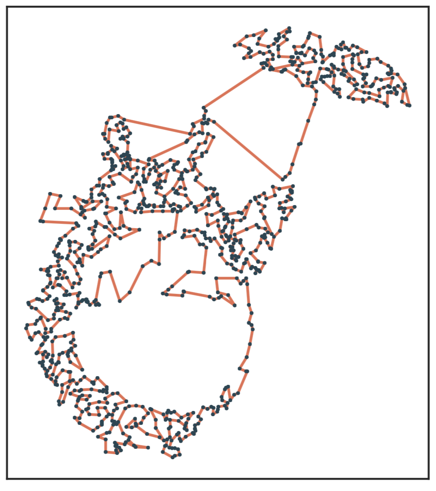

# Selected Topics in Mathematical Optimization



*Edition 2021-2022*

**Michiel Stock**

With help from **Maxime Van Haeverbeke** and **Kirsten Van Huffel**.

This repository contains the notes and exercises of the optimization course given in the Masters of Bioinformatics and Bioscience Engineering at Ghent University.

This course aims to give students a general overview of the rich field of mathematical optimization. This course will put a particular emphasis on practical implementations and performance. After this course, students should be able to formulate problems from computational biology as optimization problems and interpret, understand, and implement new optimization algorithms.

As of 2020, we have moved this course from Python to the new [Julia programming language](https://julialang.org/). This is not because we are too cool for Python (though we are too cool for Python 😎), but because Julia is supremely suited for scientific computing.  Julia code can be made highly performant, on par with optimized C code. We don't expect students to optimize code fully, but we will give hints and guidelines on improving implementations in Julia or other programming languages. No prior knowledge of Julia is needed. We will learn while doing it! To get started, you can check out our [quick start guide](chapters/00.Introduction/00-GetGoingWithJulia.md), and if you get lost, we recommend taking a look at the [cheat sheet](https://juliadocs.github.io/Julia-Cheat-Sheet/).

## Course content

1. [Intro to Julia](chapters/00.Introduction/simple_search.jl.html) and [bracket search](chapters/01.Brackets/brackets.jl.html)
2. [Quadratic optimization](chapters/02.Quadratic/quadratic.jl.html)
3. [Automatic differentiation](chapters/03.AutoDiff/autodiff.jl.html)
4. [Unconstrained convex optimization](chapters/04.Unconstrained/unconstrained.jl.html)
5. [Constrained convex optimization](chapters/05.Constrained/constrained.jl.html) and [Lagrange](chapters/05.Constrained/lagrange.jl.html)
6. [Optimal transportation](chapters/06.OptimalTransport/optimal_transportation.jl.html)
7. [Minimum spanning trees](chapters/07.MST/mst.jl.html)
8. [Shortest path problems](chapters/08.ShortestPath/shortestpath.jl.html)
9. [NP-hard problems](chapters/09.NP-Complete/np-complete.jl.html)
10. Heuristics and metaheuristics (notebooks on [PSO](chapters/10.Metaheuristics/PSO.jl.html) and [searching methods](chapters/00.Introduction/simple_search.jl.html))
11. [Travelling Salesman Problem](chapters/11.TSP/tsp.jl.html)

## Exam project

For your final exam, you will have to create a didactical or scientific project related to optimization (either theoretical or applied). The goal is being able to write scientific software.

You can check the instructions [here](project_instructions.md). It will be discussed in detail in class.

Check out previous projects [here](exam_projects/readme.md).

## Using this repo

As of 2021, we migrated from Jupyter notebooks to [Pluto](https://github.com/fonsp/Pluto.jl) notebooks. The folder `chapters/` contains notebooks. You can also find them on Ufora together with the slides etc, so you don't need to keep track of this repo.

This repo also contains the source code in `src/`. Most of this is now copied in the respective independent notebooks, which is mainly of historical importance. If you activate the environment of the repo

```julia
using Pkg; Pkg.activate(".")
```

 you can run the build file

```julia
include("build.jl")
```

In addition to the Jupyter notebooks and PDF notes, running this script also generates some example figures. We encourage students to look in the `scrips/` folder for some examples illustrating the theory. All PDF notes will also be made available on Ufora.

This repository also represents a Julia package, which can be loaded in the Julia REPL.

```julia
using STMO
```

This package contains the solution to most implementation exercises in this course. It also includes a wealth of helper functions for plotting etc.

## Installation instructions

### Github

Using Git or Github desktop is can be helpful for this course. In case you don't already have Git or Github installed, this can be done by following the instructions for your operating system here [here](https://git-scm.com/book/en/v2/Getting-Started-Installing-Git) for Git and [here](https://desktop.github.com/) for GitHub desktop. Using Git, clone (i.e., download the files of) the course repository by typing
```
git clone https://github.com/MichielStock/STMO.git
```
In the command prompt, after navigating to where you want to save the course files.

Again the notebooks are all you need, so you don't have to maintain a local version of this repo.

### Installing Julia

1. Download the *Julia* binaries for your system [here](https://julialang.org/downloads/) we suggest installing the current stable release, v1.6.2
2. Check the [Platform Specific Instructions](https://julialang.org/downloads/platform/) of the official website to install *Julia*

### OPTIONAL: Installing the STMO package

All required packages for this course are bundled together in the STMO package, which can be installed as follows.

In Julia, enter *package mode* by pressing the "`]`" key.  All required packages will be installed by then typing (or copying) at the `(v1.6) pkg> ` prompt:
```
add https://github.com/MichielStock/STMO.git
```


### Installing and using the Pluto notebooks

In a Julia REPL the Pluto notebooks can be installed using:
```julia
using Pkg; Pkg.add("Pluto")
```

When installed, load Pluto by typing

```julia
using Pluto
Pluto.run()
```

This will open Pluto in your browser. You can either open a new or sample notebook or navigate to an existing notebook.

✨ Yes, it is that simple! ✨

## Gitter

You can ask questions about the project and chapters via Gitter:

[](https://gitter.im/STMOUGent/community?utm_source=badge&utm_medium=badge&utm_campaign=pr-badge)
